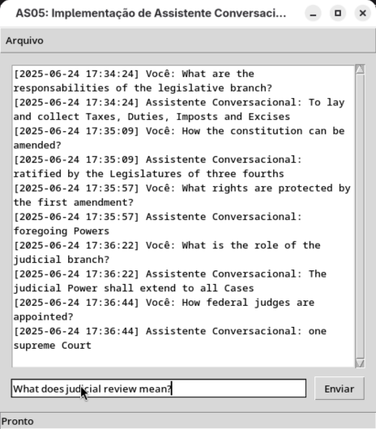

[Versão em Português](README.md)

# AS05: Implementation of LLM-Based Conversational Assistant

Practical work on the subject Topics in Computer Science III of the Computer Science course at PUC Minas in which an LLM-Based Conversational Assistant should be developed that is capable of indexing vectors (text embeddings) from a collection of PDF documents to later answer questions asked through a conversational interface.

## How to run

To run this program, follow these steps:

### Use a virtual environment (optional and recommended)

#### Create the virtual environment

In the shell (Terminal, Command Prompt, or PowerShell) inside the project folder, type:

```
python3 -m venv venv
```

or

```
python -m venv venv
```

#### Activate the virtual environment

If your shell is Linux or Mac OS Bash, inside the project folder, type:

```
source venv/bin/activate
```

If your shell is the Windows Command Prompt, inside the project folder, type:

```
venv\Scripts\activate.bat
```

If your shell is Windows PowerShell, inside the project folder, type:

```
.\venv\Scripts\Activate.ps1
```

### Install dependencies

In the shell (Terminal, Command Prompt, or PowerShell) inside the project folder, type:

```
pip install -r requirements.txt
```

### Add environment variables

Rename the ```.env.sample``` file to ```.env```.

Open the ```.env``` file in a text editor.

#### Get the Hugging Face API key:

1. Go to: https://huggingface.co/settings/tokens

   If you are not logged into Hugging Face, log in. If you do not have an account, create an account.

2. Click the ```Create new token``` button.

3. In ``Token name```, type the name of your choice for the API key.

4. Click ```Create token```.

5. In the prompt that opens, click the ```Copy``` button.

6. In the ```.env``` file, paste the token to the right of (on the same line) ```HUGGINGFACEHUB_API_KEY=```.

#### Get the Pinecone API key:

1. Go to: https://app.pinecone.io

   If you are not logged into Pinecone, log in. If you do not have an account, create an account.

2. In the left corner, click on ```Database``` and then on ```Indexes```.

3. In the left corner, click on ```API Keys```.

4. Click on the ```Create API Key``` button.

5. In the prompt that opens, type the name of your preference for the API key.

6. Click on ```Create key```.

7. In the text bar, click on the copy button.

8. In the ```.env``` file, paste the token to the right of (on the same line) ```PINECONE_API_KEY=```.

#### Get the Pinecone index name

1. Go to: https://app.pinecone.io

2. In the left corner, click on ```Indexes```.

3. If you don't have any indexes, click on the ```Create index``` button. Type the desired name for the index, and click on ```Create index``` (in the bottom right corner).

4. In the ```.env``` file, paste the index to the right of (on the same line) ```PINECONE_INDEX_NAME=```.

### Run the program

In the shell (Terminal, Command Prompt, or PowerShell) inside the project folder, type:

```
python3 app
```

or

```
python app
```

And a program window will open.

## Application in Operation

### Video

In [this video](https://youtu.be/sO1tvquSQWM) (in Portuguese) you can see the application in operation:

[](https://youtu.be/sO1tvquSQWM)

### Screenshot

